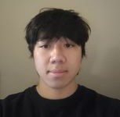

# Nathan Bui
***Computer Engineering Major***

[[More about me](#about-me)][[Goals](#goals)]

My repository called [User Page](https://github.com/nathanbui90/UserPage/blob/main/README.md).

Favorite quote from Tom Hanks:

>If it wasn't hard, everyone would do it. It's the hard that makes it great.

Use `gdb` for debugging. Commands for gdb:

```
break
run
quit
```


## Skill in Programming Languages:

- **Proficient**
  - *Java*
  - *Python*
  - *C*
  - *C++*
- **Basic Understanding**
  - Assembly
  - JavaScript


### **Goals**

- [x] Intern at Northrop Grumman 
- [ ] Graduate from UCSD as an Undergraduate
- [ ] Get a master's degree
- [ ] Complete a V10 climb in Bouldering

## *About me*

1. Enjoys Rock Climbing
2. Learning the Guitar
3. *~~Freshman~~*
*Sophmore at UCSD*

UCSD [[Courses](Courses.md)] I'm currently enrolled in.